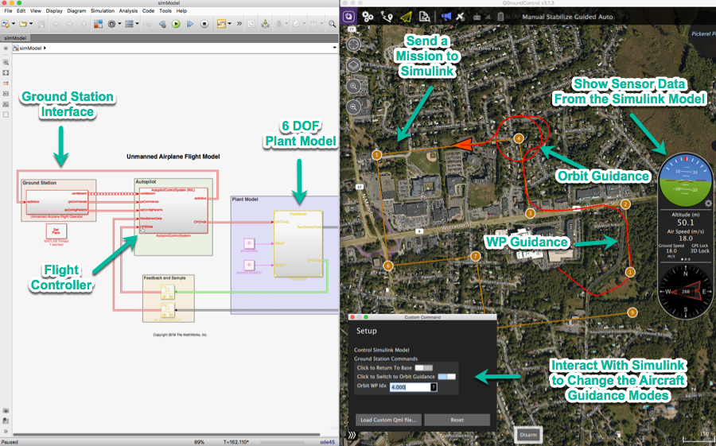
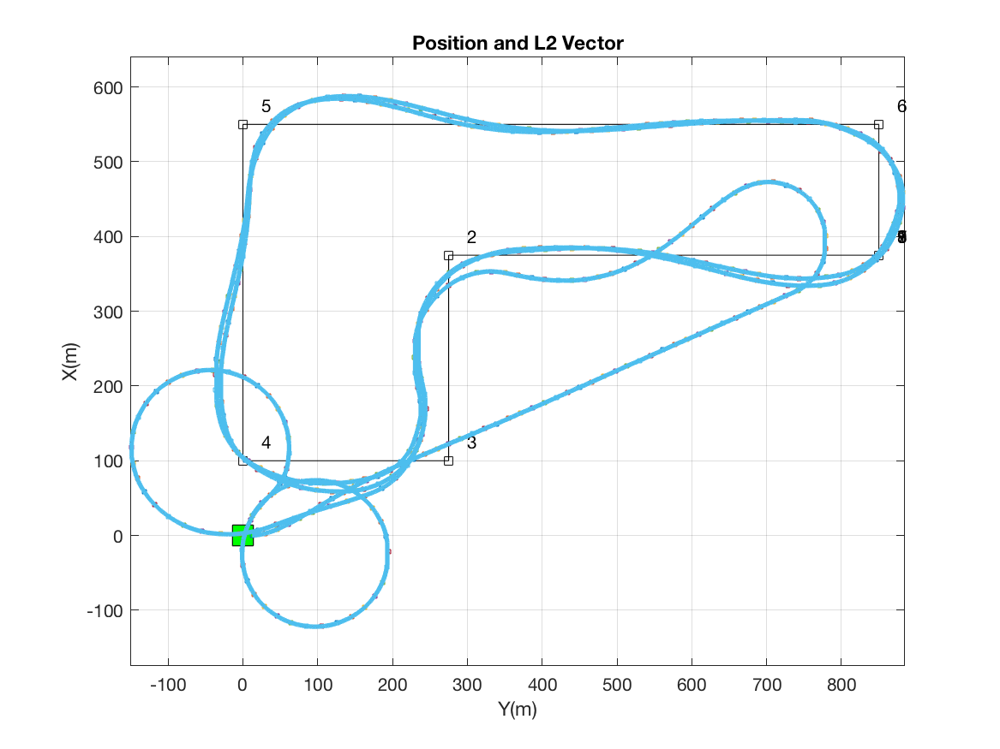

# Simulink Drone Reference Application
###### Copyright 2018 The MathWorks, Inc.
[](https://www.mathworks.com/matlabcentral/fileexchange/67625-simulink-drone-reference-application)

This Simulink Project shows the implementation of a Remotely Piloted Radio-Control fixed-wing aircraft (i.e. Drone, UAV), an autopilot for flight stabilization, and an operator interface to control its trajectory. 

## Components

The model consists of three main components:

### 1. Plant model

A Six-Degree-Of-Freedom (6-DOF) dynamics model for a foam-built, 65-inch wingspan, Multiplex Mentor hobby radio controlled aircraft. It consists of models for the aircraft dynamics, the weather, the motor, the actuators and the sensors. The plant receives commands for the four actuator channels: (1)Throttle, (2) Ailerons, (3) Rudder, and (4) Elevator. In turn, it produces a set of readings as those that a sensor suite would produce on board this type of aircraft.

The plant model uses a flat-earth approximation and therefore it will only work for flights which have a range of approximately 20 Km..

### 2. An autopilot model.

The autopilot controller is a classical lateral/longitudinal channel flight controller which includes Guidance, Navigation and Control (except attitude estimation as this is assumed to be obtained directly from the sensor suite). The autopilot, based on the ground control station commands and the sensor readings, produces control commands for the control surfaces and also reports telemetry back to the ground station. This block stabilizes the aircraft to keep it in-flight.

It allows the operator to command it to fly in four different modes:

- Waypoint guidance.
- Circular Guidance.
- Return to Base.
- Mid-level contro commands (Uc, phi_c, H_c)


### 3. An aircraft operator interface.

This represents the console operating the RC Aircraft in flight. It issues commands sent from the ground to the aircraft (waypoints, airspeed, height, etc...).

The block receives telemetry reported by the aircraft such as attitude, sensor readings, and overall aircraft status. This will allow to set the desired behavior of the aircraft while in-flight.

This model has the option to interact with the well-know, publicly available Open Source Micro Air Vehicle ground station software  QGroundControl. To communicate with QGroundControl, the model uses the MAVLink communications protocol.

## Functionality

This Simulink Project  exercises several common workflows in flight control development. Its purpose is to show a recommended approach to a Model-Based Design (MBD) process to develop a proof of concept Drone flight controller (autopilot). Particularly we show the following workflows:

1. **Flight Controller Design** Develop a fixed-wing drone autopilot and test its behavior in a reasonably realistic 6DOF aircraft simulation.

2. **Simulate the Flight Controller Under Different Conditions**: Rapidly asses the performance of an autopilot under many simulated flight conditions, using local parallel simulations.

3. **Flight Envelope Characterization** Rapidly characterize the Aircraft’s performance by doing a wide range of environmental and initial conditions sweep using MATLAB Distributed Computing Server.

4. **Drone SME Capabilities Assessment** Demonstrate to a Subject Matter Expert (SME), early in the design process, the Drone’s capabilities and gather feedback on usability and its functionality, via co-simulation between Simulink and QGroundControl Ground Station Software.

5. **Test Behavior of the Fight Controller’s Generated Code** Test the code behavior using Simulink's Software-In-the-Loop on the development computer for same results (within bounds) of the designed autopilot.

6. **Deploy and Test Correctness of the Flight Controller’s Generated Code** Test the code’s behavior on a development board (a Raspberry Pi) for same results (within bounds) using Simulink's Processor-In-the-Loop.

7. **System Integration Test (Hardware-In-the-Loop)** Test the flight controller deployed in the development board (Raspberry Pi) with a 6DOF aircraft simulation running in a Speedgoat Real-Time computer with Simulink Real Time.

## Co-Simulation
This model can interact with the Open Source QGroundControl ground station software to control the aircraft while "in flight":



# Getting Started

To run the model clone the repository into your own working directory and, from the MATLAB command line:

```matlab
    >> uiopen('pathToYourProject/MBDRI.prj',1)
    >> runShortFlight
```
This should produce five plots, the first being an XY plot of a complete mission around 6 waypoints, as shown below:



## Prerequisites
This model has been tested in MATLAB R2017b running in either Windows 10, MacOS High Sierra (10.13), or Debian Linux. 


To get the full functionality, you will need a Laptop or Desktop computer running one of the operating systems previously mentioned, MATLAB R2017b, Simulink, Stateflow, and a supported compiler plus the following products depending on the workflow:

### For Flight Control Design

- Control Systems Toolbox

### Simulate the Flight Controller Under Different Conditions

- Parallel Computing Toolbox

### Flight Envelope Characterization

- Parallel Computing Toolbox
- MATLAB Distributed Computing Server

### SME Assesment and Connectivity to QGroundControl

- QGroundControl 3.1.3 or higher.

### For Testing and Deploying the Behavior of the Fight Controller’s Generated Code

- A Raspberry Pi 2 or 3 board.
- MATLAB Coder
- Simulink Coder
- Embedded Coder
- Simulink Support Package for Raspberry Pi

### For System Integration Test (Hardware-In-the-Loop)

- A computer running Windows 10
- Simulink Real Time.
- A supported Speedgoat Real-Time computer with two ethernet ports.
- A Raspberry Pi 2 or 3 board.
- MATLAB Coder
- Simulink Coder
- Simulink Support Package for Raspberry Pi

# Contributing

If you are interested in contributing we are definitely interested in hearing from you. There are many open tickets and we are sure this list will only grow, so feel free to contribute by owning one of those tickets and send us a pull request.

If you would like to suggest an enhancement please create a new issue and apply the _enhancement_ label. This is no guarantee that we will get to it, but we will definitely take it into consideration. 

If you have encountered a bug, please create a new issue and apply the _bug_ label.


